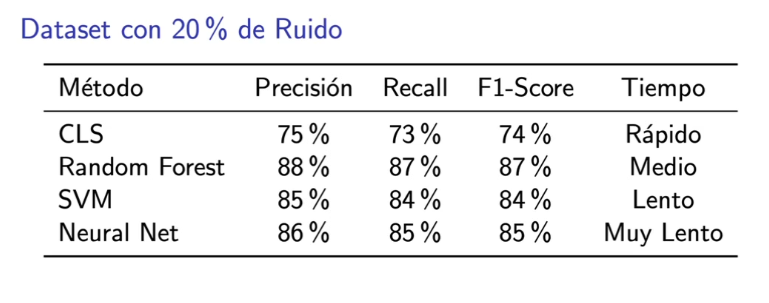

# Árboles de decisión

Los árboles de decisión datan de los años 60.

# Concept learning system

Un sistema de aprendizaje de conceptos es un paradigma de aprendizaje machín que busca inferir algo general a partir de ejemplos específicos. El objetivo es aprender una función que pueda clasificar nuevas instancias como pertenecientes o no al concepto objetivo.

Nació en los años 60 en el campo de la IA, busca modelar el aprendizaje de conceptos a partir de ejemplos positivos y negativos, una de las primeras aproximaciones al aprendizaje supervisado, basado en encontrar la hipotesis más específica que sea consistente con los datos observados.

Desarrollado en un contexto donde se buscaban modelos formales de aprendizaje machín, inspirado en la idea de aprender con base en ejemplos e influenciado por los primeros trabajos en lógica y computación, representa un enfoque inicial hacia la automatización del razonamiento inductivo.

* **Inductivo:** de lo particular a lo general, generar hipótesis
    * Ejemplo: según las estadísticas, los ingenieros civiles suelen ser hombres.
* **Deductivo:** de los general a lo particular, confirmar hipótesis
    * Ejemplo: una persona que es ingeniero civil probablemente será hombre.

# Formalización matemática

**Definiciones:**

* **Espacio de hipótesis H:** conjunto de todas las posibles hipótesis
    * (x_i): un dato con atributos (a1, a2, ..., an)
    * (yi): clasificación del ejemplo, yi pertenece a {0,1}
* **Función de consistencia:**
    * h(x) = 1 si x satisface los criterios de h, 0 de lo contrario
* **Algoritmo de aprendizaje:**
    * Inicialización con hipótesis general o específica
    * Se ajusta la hipótesis con base en ejemplos positivos o negativos
    * Se refina hasta que no haya contradicciones con los datos

Inicializamos la hipótesis h como la expresión más general. Ejemplo: (xi, yi) es positivo y h(xi) es falso

**Meta:** Buscar una hipótesis h en H tal que h(x) = c(x) para todos los ejemplos de entrenamiento, donde existen pares (x, c(x)) donde x es una instancia y c(x) es una etiqueta.

**Desafío:** La hipótesis también debe generalizar bien a nuevas instancias no vistas durante el entrenamiento.

Consistencia + generalización

# Proceso de aprendizaje

1. Partimos de la hipótesis más general (h0 = T) o la más específica (h0 = perpendicular)
2. Se actualiza la hipótesis con base en ejemplos positivos y negativos.
3. Se obtiene una hipótesis final consistente con los datos

**Ejemplo:**

* Hipótesis inicial: h = (?,?,?)
    * La preguntación significa comodín, quiere decir que cualquier valor es válido para ese atributo. Ejemplos:
        * (manzana, roja, grande): sólo manzanas rojas y grandes
        * (manzana, ?, grande): manzanas grandes, cualquier color
        * (manzana, ?, ?): manzanas, cualquier color y tamaño
* Ejemplo positivo: (A,B,C) -> 1 => h = (A,B,C)
* Ejemplo negativo: (A,B,D) -> 0 => hipótesis permanece

**Discusión:**
* ¿Qué sucede si hay ruido en los datos?
* ¿Cómo se compara con otros métodos de aprendizaje supervisado?

# Tipos principales de algoritmos

* **Conjunctive concepts:** conceptos definidos por conjuntos de atributos
* **Version spaces:** mantiene el conjunto de todas las hipótesis consistentes
* **Find-S:** encuentra la hipótesis más especifica que sea consistente
* **Candidate elimination:** mantiene hipótesis más generales y específicas

# El algoritmo Find-S

Este algoritmo encuentra la hipótesis más específica que sea consistente para todos los ejemplos positivos.

**Reglas:**

* **Inicialización:** h = (null, null, null)
* **Ejemplos negativos:** no actualizar la hipótesis
* **Ejemplos positivos:**
    * Si es el primero: copiar todos los atributos
    * Difiere: generalizar el atributo a ?.
* **Simbología:**
    * null = imposible
    * preguntación = cualquier valor

## Problema de ejemplo: un buen día para jugar tenis

**Objetivo:** aprender cuándo es un buen día para jugar tenis basado en condiciones climáticas.

**Atributos:**
* **Clima:** { soleado, nublado, lluvioso }
* **Temperatura:** { caliente, templada, fría }
* **Humedad:** { alta, normal }
* **Viento:** { fuerte, débil }

**Una instancia:** (soleado, caliente, alta, débil)

**Juego de datos:**

| Sol | Temperatura | Humedad | Viento | ¿Se puede jugar? |
| --- | ----------- | ------- | ------ | ---------------- |
| soleado | caliente | alta | débil | no
| soleado | caliente | alta | fuerte | no
| nublado | caliente | alta | débil | sí
| lluvioso | templado | alta | débil | sí
| lluvioso | frío | normal | débil | sí
| lluvioso | frío | normal | fuerte | no

## Solución

**Inicialización:** h = (null, null, null, null)

**Recorremos el conjunto de datos.**

1. (soleado, caliente, alta, débil) = no
    * Negativo, no se actualiza, h = (null, null, null, null)
2. (soleado, caliente, alta, fuerte) = no
    * Negativo, no se actualiza, h = (null, null, null, null)
3. (nublado, caliente, alta, débil) = sí
    * ¡Positivo!
    * Primer ejemplo positivo, copiamos todo
    * h = (nublado, caliente, alta, débil)
4. (lluvioso, templado, alta, débil) = sí
    * Positivo, ya tenemos hipótesis, actualizamos
    * Nivel de sol difiere, h = (?, caliente, alta, débil)
    * Temperatura difiere, h = (?, ?, alta, débil)
    * Humedad es igual, h = (?, ?, alta, débil)
    * Viento es igual, h = (?, ?, alta, débil)
5. (lluvioso, frío, normal, débil) = sí
    * Humedad difiere, h = (?, ?, ?, débil)
    * Viento es igual, h = (?, ?, ?, débil)
6. (lluvioso, frío, normal, fuerte) = no
    * Negativo, saltamos

Y así llegamos a nuestro modelo de decisión: h = (?, ?, ?, débil)

**Problema:** ¿Qué pasa si por alguna razón sí podemos jugar tenis con mucho viento y guardamos eso? Pues la hipótesis termina haciéndose h = (?, ?, ?, ?) y se vuelve inútil. Pasa a ser una hipótesis que no nos dice nada.

## Limitaciones de Find-S

* Sólo considera ejemplos positivos, ignora los negativos.
* Encuentra hipótesis específicas, por lo que puede sobregeneralizar.
* Da por sentado que todos los ejemplos son correctos; en la vida real eso no suele ser el caso.
* Una sola hipótesis a la vez.

Si nustros datos tuvieran un día de viento fuerte en el cual pudimos jugar tenis, esto le parte la mandarina en gajos a la hipótesis y nos saldría algo que claramente contradice nuestros datos. Find-S no es capaz de tomar en cuenta matices, es absoluto.

# Generadiles

## Ruido en datos

**Ruido en datos:** valores incorrectos o imprecisos, errores de medición, datos faltantes, datos patológicos.

**Ruido en etiquetas:** clasificación incorrecta, inconsistencias en el etiquetado, ambigüedad en clases, error humano en anotación.

| Método | Fortaleza | Debilidad |
| - | - | -
| CLS | Reglas explícitas | Altamente sensible al ruido
| Bosque aleatorio | Robusto al ruido | Menos interpretable
| SVM | Margen de separación | Complejidad computacional 
| Redes neurales | Adaptables | Requiere muchos datos
| Bayes ingenuo | Probabilístico | Supuestos fuertes

**Estrategias de manejo de ruido:**

* **CLS:** Preprocesamiento, validación cruzada, reglas de poda, umbrales de confianza
* **Otros métodos:** Regularización, ensemble learning, técnicas bayesianas, validación robusta.

**Preprocesamiento:**

* Limpieza de datos
* Detección de patológicos
* Normalización
* Manejo de valores faltantes

## Problemas específicos de los CLS

* **Sobreespecialización:** reglas demasiado específicas, pérdida de generalización, recordar el ruido como si fueran datos.
* **Inconsistencias:** reglas contradictorias, conflictos en clasificación, decisiones inestables.
* **Convergencia:** dificultad para encontrar reglas consistentes, mayor tiempo de entrenamiento, posible no convergencia.
* **Complejidad computacional exponencial.**
* **Sensible al orden de los ejemplos.**

## Cuándo usar CLS

**Sí usar cuando:**
* Los datos están limpiecitos y estructurados.
* El dominio está bien definido.
* Es fundamental interpretar los datos.
    * Ejemplo: la ley mexicana en materia crediticia le dice a los bancos qué modelos pueden usarse para determinar la elegibilidad de una persona para contratar crédito, pues un modelo poco interpretable sería una violación al principio de legalidad de la Constitución al arrojar un resultado que no pueda ser fundado y motivado; los CLS aquí permiten rastrear los motivos que llevaron al algoritmo a determinar otorgarle o negarle el crédito a una persona.

**No usar cuando:**
* Hay mucho ruido.
* Los datos son inconsistentes.
* La precisión es más importante.

**Ejemplos de aplicaciones:**

* **Detección de spam:**
    * **Atributos:** "oferta" en el título, enlace externo, remitente desconocido
    * **Ejemplo de hipótesis final:** h = (?, True, True) -- es spam si tiene un enlace externo y proviene de un remitente desconocido.
* **Diagnóstico médico.**

## Relación con otros modelos

